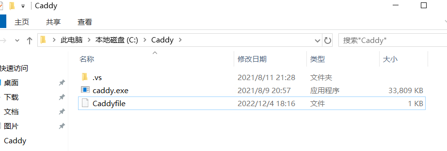
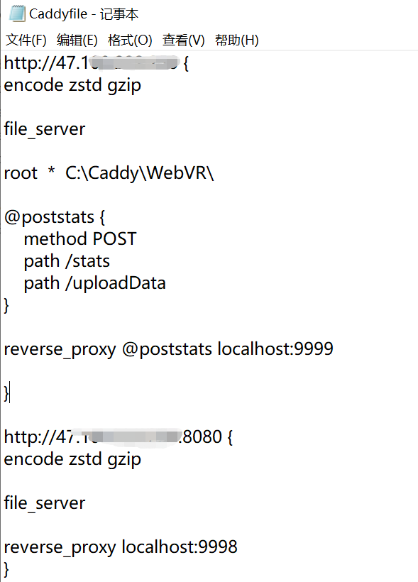
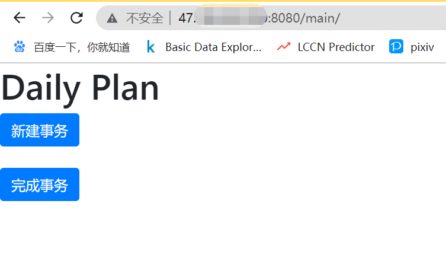

# Daily Plan

这个项目主要是用于监督我每天好好干活用的，众所周知，我的天生懒狗，精力更是不足，为了尽量使我的人生能够维持，今天（2023年5月22日）还是花一些时间来部署一个项目，每天发邮件来提示我做哪些必要的事情。免得我本就萎缩的大脑因为忙乱忘记重要的事情。


另外，这个项目是用django搭的，这样我可以随时做出一些必要的访问，由于我的菜狗本质，我对这框架完全不熟，只能现学现用。所以可能也会顺便记录一些语法方面的玩意儿。

## 1.需要的功能:

这里首先列出需求，因为我也是最近阳过后才想到该做这么一件事情。只是有一个大致的想法，那就是把每天要做的事情定时发给我确认，然后每天分享到社交平台去，让我社死以达到监督的作用。

### 1.1 需求分析

生活当中的事情也可以分为有周期规律的日常事务（也就是习惯），以及临时出现需要处理的事件。

根据经验，日常事务通常是易于估计出完成该事件所消耗的时间精力的，因此可以根据自身情况不断微调，以一个长期的视角进行规划以达成某种期望。临时出现的事情则可能有重复性，要注意利用好轮子来避免重复劳动。

### 1.2 基本需求

该项目的基本需求分为: (1) 日常事务构建; (2) 临时事务添加; (3) 事件提醒; (4) 事件完成提交 以及 (5) 事件发布。

#### 1.2.1 日常事务构建

属性:

    1> 事务名称
    2> 周期 或 每周的哪一天
    3> 是否完成当前周期 (查看 Only)
    4> 重要程度值
    5> 提醒周期
    6> 进度
    7> 备注

功能:

    1> 手动添加事务
    2> 手动删除事务
    3> 进度完成后自动删除(?)

#### 1.2.2 临时事务添加

属性:

    1> 事务名称
    2> 时限
    3> 重要程度值
    4> 提醒周期
    5> 备注

功能:

    1> 手动添加事务
    2> 完成或放弃事务 (分别记录)

#### 1.2.3 事件提醒

根据周期在某些时间点定时提醒我还有哪些事情没做，暂时定为早上7点，中午12点以及晚上7点，形式为邮件。

需要筛查一下哪些提醒应该在何时发送，不要一次性发送太多，导致我神经紧张。

#### 1.2.4 事件完成提交

这个功能是对完成事件后的一个总结，弄成从已有事件中选一个来记录，日常事务打卡进度，临时事务勾选完成或放弃。需要记录完成的时间和一些文字、图片信息，以供日后复盘。

#### 1.2.5 事件发布

每天凌晨1点给指定群发布信息，形式为pdf，形成监督。

## 2.功能实现记录

### 2.1 django 基本配置

django 管理前端，数据保存为.xlsx文件。

manage.py : 项目的管理，启动项目、创建app、数据管理 (不要动)

settings.py : 项目配置 (***常常操作***)

urls.py : URL和函数的对应关系 (***常常操作***)

asgi.py : 接收网络请求 (不要动)

wsgi.py : 接收网络请求 (不要动)

创建 app 命令: python manage.py startapp $app_name$

创建了app01，在settings.py中的 INSTALLED_APPS 列表添加了 'app01.apps.App01Config'，将创建的APP进行注册。

在urls.py中，导入app01.views文件，将urlpatterns列表中的path替换为: path('index/', views.index)，表明路径和函数的调用关系。

启动服务: python manage.py runserver

写对应的.html文件，在app01目录下添加名为 templates 的文件夹，存放对应的 .html文件。

图片等资源文件的使用，在app01目录下添加名为 static 的文件夹，存放于此。

### 2.2 html 和 javascript

这两者同属前端，用于生成控件，并接收网页上的输入的，总的来说，html适合于写一些固定的内容，而javascript来做一些简单的控制。例如通过如下语句来生成相应控件，再返回给html显示。

```
document.createElement("div");
```

而 html 中的控件组织形式也遵循于树状结构，能够通过父子关系和 id属性进行查找。

```
var optionsContainer = document.getElementById('options');
optionsContainer.firstChild;
```

因为 javascript 中支持这样的关系索引函数，以及常见的如列表、字典等数据结构和选择循环等语法结构，因此能够控制html做动态的显示。

此外必须注意的是，数据在 django(python) \ html \ javascript 三者通信的问题。这个要分情况讨论一下:

(1) html -> javascript: 首先要将传输的数据放在一个 html 容器中，然后在 js 文件中访问容器调用:

html:
```
<div id="routine_dct" data-dict= "{{ routine }}" > </div>
```

javascript:
```
var display_dct_string = document.getElementById("routine_dct").getAttribute("data-dict");
```

感觉这种方法也许比较笨重，但是也可以接受。

(2) javascript -> html: 通常不需要，因为可以直接由 js 控制 html 页面的行为，实在需要也可以通过返回值或者也装进某个容器当中。

(3) html -> django: 经典提交表单，把要传递的内容相关的容器放在一个 from 标签中，要传递的容器内容要填写 name项 和 value项，这样能够通过一个字典的形式传递给 django 端。

```
<form method="POST" id="form_submit">
      
      <div id="options"></div>
      <script>
        var optionsContainer = document.getElementById('options');
        optionsContainer.appendChild(generateRoutine());
      </script>
      <input class="btn btn-primary" type="submit" name="submit" value="提交">
      <input class="btn btn-primary" type="submit" name="back" value="返回"> <br><br>
</form>
```

django 方面通过 request 变量来获取请求状态和获取字典内容，字典内容存储于 request.POST 中：

```
'''
函数create_transaction()需要在 urls.py 中进行注册，建立页面地址和回调函数的联系。

'''
def create_transaction(request):
    if request.method == "POST":
        if "back" in request.POST:
            pass
            # ... any others
```

(4) django -> html:

还是页面注册函数，将数据以字典的形式写在返回值中即可，例如:

django:
```
def create_transaction(request):
    '''
    ... ...
    '''
    rnt_dict = {"dict for html" : " to use"}
    return render(request, 'create_transaction.html', rnt_dict)
```

html 引用采用 双重花括号的方式: {{}}, 其实 django 那边不止可以传字典，其他基础数据结构也是支持的。

html:
```
{{ rnt_dict }}
```

### 2.3 公网部署

使用 Caddy, 装好 Caddy后，创建一个名为 Caddyfile 的文件，声明一个反向代理，具体步骤如图：



（被挡住的为服务器ip）

然后在django项目中进行启动即可成功访问：

```
python manage.py runserver 9998
```
